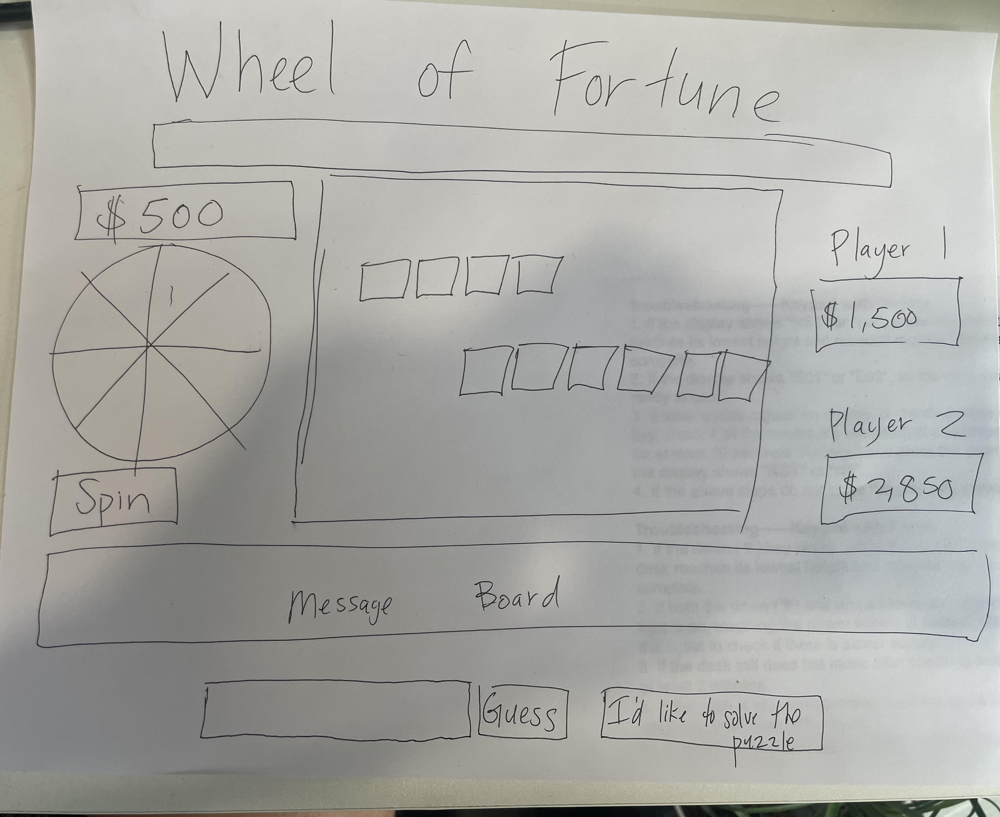

# WHEEL OF FORTUNE!

## Elevator pitch

Wheel of fortune is a beloved global TV show and I intend to make a web version of the show! Contestants will compete for a grand prize by solving word puzzles (a word or phrase). Players will be presented with white squares, with the number of squares corresponding to the number of letters in the word puzzle. Each player will get to guess one letter at a time. If the letter is in the puzzle, then they can guess again. Each turn, they spin the Wheel of Fortune, which has point values on a wheel. If they correctly guess a letter, they will receive whatever point value their spin lands on. If, on their turn, they want to solve the puzzle, they can press a button to type in the answer. 

## Tech Stack

For this project, I will rely on HTML, CSS for styling, and Javascript for functionality.

## Wireframe
<!-- link to image -->

## MVP
Render a start screen with instructions on how to play
Render a game screen with:
- Wheel of Fortune banner
- A colorful wheel with point values attached to each slice of the wheel
- Message board
- Output screen showing point values
- Running total values for each player
- Buttons to start game, spin, enter the letter guess, solve the puzzle, reset game
- Input box to guess a letter or the puzzle
- Puzzle board screen with white tiles representing letters of the word
Render the winning screen and prize
Create array of possible word options with corresponding word categories that are randomly selected at the start of a new game.
Render a dollar value on the screen after a player presses the "Spin" button - the value is chosen from an array of possible dollar values
Create logic to display prompts on message board at the correct time, e.g. "Player 1, it's your turn. Spin the wheel!", "Player 1, guess
Create logic to check if a letter is in the given word/phrase, appropriate points added to to respective player if letter is in word
Create logic to continue with same player if correct letter is guessed, and switch to next player if letter is not in word
When player selects "Solve the Puzzle" button, checks if phrase is correct and if yes, projects the winning message
The "start new game" button resets the game and randomly generates a new word puzzle

## Stretch Goals
Render the wheel so that wheel actually spins and lands on the correct point value when the "SPIN" button is pressed
"Lose a turn" tile on wheel of fortune and logic to skip player's turn
Allow up to 4 players and at the start of the game, ask how many players will be playing 
Unlimited number of words and phrases pulled in somehow

## Potential Roadblocks
Successfully creating layout of screen in a way that looks nice and is functional
Auto-spacing out the letter tiles of the word puzzle - do I use flexbox for this?

